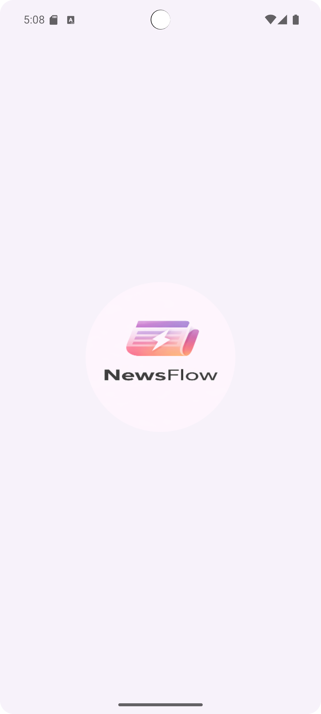
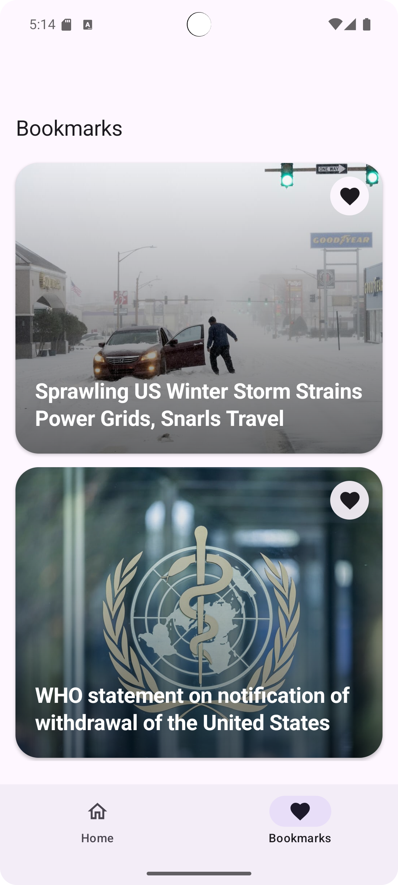

# 📰 NewsFlow

NewsFlow is a simple Android news app built using **Jetpack Compose**.  
It shows top headlines and allows users to bookmark articles and read full news inside the app.

---

## ✨ Features
- Top headlines
- Bookmark articles
- Read full articles in WebView
- Clean and modern UI
- Android 12 splash screen

---

## 🛠 Tech Stack
- Kotlin
- Jetpack Compose
- Material 3
- Hilt
- Retrofit
- Room
- Coil
- Navigation Compose

---

## 📸 Screenshots

<p float="left">
  
  
  
  
</p>

---

## ▶️ How to Run
1. Clone the repository
   ```bash
   git clone https://github.com/your-username/NewsFlow.git
